# Issue Lifecycle State Machine Diagram

## 🎯 Overview

This document provides a comprehensive Mermaid state machine diagram showing the complete lifecycle of an issue from creation through closure, including all possible paths, automated gates, manual gates, and transition criteria.

### 📝 Code Implementation References

This state machine is implemented across multiple workflows and scripts:

- **Workflows**: `.github/workflows/`
  - `issue-intake.yml` - Initial validation and PM review trigger
  - `rebalance-on-close.yml` - Lane rebalancing automation
  - `ai-code-review.yml` - Multi-round PR review process
  
- **Scripts**: `scripts/`
  - `issue-intake.js` - Auto validation, project assignment
  - `pm-review.js` - PM triage, lane assignment, issue splitting
  - `rebalance-lanes.js` - Automated lane management

---

## 📊 Complete State Machine Diagram

```mermaid
stateDiagram-v2
    [*] --> Issue_Created: User creates issue\with template

    %% Initial State
    Issue_Created: Issue Created

    %% First Gate: Triage
    Issue_Created --> Auto_Validation: Issue created
    Auto_Validation: Auto Validation - Gate

    Auto_Validation --> Validation_Failed: Validation fails
    Validation_Failed: Validation Failed
    Validation_Failed --> Needs_Details: Request details
    Needs_Details: Needs Details
    Needs_Details --> Auto_Validation: User updates
    Needs_Details --> Auto_Abandoned: No response - 30d
    Auto_Abandoned: Auto Abandoned
    Auto_Abandoned --> [*]

    Auto_Validation --> Backlog: Pass validation
    Backlog: Backlog

    %% Triage Stage
    Backlog --> PM_Triage: To triage
    PM_Triage: PM Review - Manual

    PM_Triage --> Triage_Rejected: Reject
    Triage_Rejected: Triage Rejected - Out of Scope
    Triage_Rejected --> Closed_Rejected: Close
    Closed_Rejected: Issue Rejected
    Closed_Rejected --> [*]

    PM_Triage --> Assigned_Lane: Assign lane
    Assigned_Lane: Lane Assigned

    %% Lane Assignment Logic
    Assigned_Lane --> On_Bench: Low priority
    On_Bench: On The Bench

    Assigned_Lane --> In_Hole: With dependencies
    In_Hole: In The Hole

    Assigned_Lane --> On_Deck: Next in line
    On_Deck: On The Deck

    Assigned_Lane --> At_Bat: Ready now
    At_Bat: At Bat

    %% Bench Lane Flow
    On_Bench --> Bench_Check: Monitor
    Bench_Check: Bench - Waiting
    Bench_Check --> Rebalance_Bench: Rebalance trigger
    Rebalance_Bench: Rebalance
    Rebalance_Bench --> In_Hole

    %% In The Hole Flow
    In_Hole --> Hole_Check: Monitor
    Hole_Check: Hole - Waiting
    Hole_Check --> Rebalance_Hole: Rebalance trigger
    Rebalance_Hole: Rebalance
    Rebalance_Hole --> On_Deck

    %% On The Deck Flow
    On_Deck --> Deck_Check: Monitor
    Deck_Check: Deck - Waiting
    Deck_Check --> Rebalance_Deck: Rebalance trigger
    Rebalance_Deck: Rebalance
    Rebalance_Deck --> At_Bat

    %% At Bat Implementation
    At_Bat --> AC_Check: Verify AC
    AC_Check: At Bat - AC Check
    AC_Check --> Dev_Assigned: AC Ready
    AC_Check --> Needs_Prep: AC Needed
    Needs_Prep: Needs Preparation
    Needs_Prep --> AC_Check
    Dev_Assigned: Development Started

    %% Implementation Flow
    Dev_Assigned --> Dev_In_Progress: Create branch
    Dev_In_Progress: In Development

    Dev_In_Progress --> PR_Created: Create PR
    PR_Created: PR Created

    PR_Created --> Stage_1_PR_Format: Validate format
    Stage_1_PR_Format: Stage 1 - PR Format Check

    Stage_1_PR_Format --> Stage_1_Fail: Invalid
    Stage_1_Fail: PR Format Failed
    Stage_1_Fail --> Needs_PR_Update: Update PR
    Needs_PR_Update: Needs PR Update
    Needs_PR_Update --> Stage_1_PR_Format

    Stage_1_PR_Format --> Stage_2_AI_Review: Valid - Start review
    Stage_2_AI_Review: Stage 2 - Copilot Code Review

    %% Multi-Round Review
    Stage_2_AI_Review --> Review_R1: Begin review
    Review_R1: AI Review - Round 1
    Review_R1 --> Check_R1: Evaluate
    Check_R1: Review Decision R1
    Check_R1 --> AI_Comments_R1: Issues found
    Check_R1 --> AI_Approved_R1: No issues
    AI_Comments_R1: AI Review - Issues Found
    AI_Comments_R1 --> Auto_Fix_Attempt: Auto fix
    Auto_Fix_Attempt: Auto-Fix Attempt - R1 of 3
    Auto_Fix_Attempt --> Re_Review_R1: Re-review
    Re_Review_R1: Stage 2 - Code Review - R2 of 3
    Re_Review_R1 --> Check_R2: Evaluate
    Check_R2: Review Decision R2
    Check_R2 --> AI_Comments_R2: Issues found
    Check_R2 --> AI_Approved_R2: No issues

    AI_Comments_R2: AI Review - Issues Found
    AI_Comments_R2 --> Auto_Fix_Attempt_2: Auto fix
    Auto_Fix_Attempt_2: Auto-Fix Attempt - R2 of 3
    Auto_Fix_Attempt_2 --> Re_Review_R2: Re-review
    Re_Review_R2: Stage 2 - Code Review - R3 of 3
    Re_Review_R2 --> Check_R3: Evaluate
    Check_R3: Review Decision R3
    Check_R3 --> AI_Comments_R3: Issues remain
    Check_R3 --> AI_Approved_R3: No issues

    AI_Comments_R3: AI Review - Issues Found
    AI_Comments_R3 --> Escalation_Decision: Escalate after R3
    Escalation_Decision: Escalation Logic
    Escalation_Decision --> Auto_Assign_Maintainer: Assign to human
    Auto_Assign_Maintainer: Assigned to Maintainer
    Auto_Assign_Maintainer --> Stage_5_Escalated

    AI_Approved_R2 --> Stage_3_Acceptance
    AI_Approved_R1 --> Stage_3_Acceptance
    AI_Approved_R3 --> Stage_3_Acceptance

    %% Stage 3: Acceptance Criteria
    Stage_3_Acceptance: Stage 3 - Acceptance Criteria
    Stage_3_Acceptance --> AC_Check: Verify
    AC_Check: AC Check
    AC_Check --> AC_Failed: Not met
    AC_Check --> Stage_4_CI_CD: Met
    AC_Failed: AC Failed
    AC_Failed --> AC_Needs_Update: Update
    AC_Needs_Update: Needs AC Update
    AC_Needs_Update --> AC_Check

    %% Stage 4: CI/CD
    Stage_4_CI_CD: Stage 4 - CI/CD Checks
    Stage_4_CI_CD --> CI_Check: Run tests
    CI_Check: CI Check
    CI_Check --> CI_Failed: Failed
    CI_Check --> Stage_5_Human: Passed
    CI_Failed: CI/CD Failed
    CI_Failed --> CI_Needs_Fix: Fix
    CI_Needs_Fix: Needs CI/CD Fix
    CI_Needs_Fix --> CI_Check

    %% Stage 5: Human Approval
    Stage_5_Human: Stage 5 - Human Approval - Manual
    Stage_5_Escalated: Stage 5 - Human Approval - Escalated

    Stage_5_Human --> Maintainer_Review: Begin review
    Maintainer_Review: Maintainer Review
    Maintainer_Review --> Review_Decision: Decide
    Review_Decision: Approval Decision
    Review_Decision --> Approval_Rejected: Request changes
    Review_Decision --> Stage_6_Merge: Approve

    Stage_5_Escalated --> Maintainer_Review_Esc: Review escalated
    Maintainer_Review_Esc: Maintainer Review - Escalated
    Maintainer_Review_Esc --> Review_Decision_Esc: Decide
    Review_Decision_Esc: Escalation Approval Decision
    Review_Decision_Esc --> Approval_Rejected_Esc: Reject
    Review_Decision_Esc --> Stage_6_Merge: Approve

    Approval_Rejected: Changes Requested
    Approval_Rejected --> Dev_Updates: Developer updates
    Dev_Updates: Awaiting Updates
    Dev_Updates --> Maintainer_Review

    Approval_Rejected_Esc: Rejected by Maintainer
    Approval_Rejected_Esc --> PR_Closed_Rejected: Close PR
    PR_Closed_Rejected: PR Rejected
    PR_Closed_Rejected --> Closed_Failed: Redesign needed
    Closed_Failed: Issue Rejected - Design
    Closed_Failed --> [*]

    %% Stage 6: Merge
    Stage_6_Merge: Stage 6 - Merge to Main
    Stage_6_Merge --> Auto_Merge: Merge
    Auto_Merge: Merging...
    Auto_Merge --> Merged_Success: Merged
    Merged_Success: PR Merged
    Merged_Success --> Issue_Complete: Complete
    Issue_Complete: Issue Complete

    %% Close Issue
    Issue_Complete --> Close_Issue: Close
    Close_Issue: Issue Closed - Completed
    Close_Issue --> [*]

    %% Alternative: Manual Close
    At_Bat --> Manual_Close_Check: Manual close?
    Manual_Close_Check: Manual Close Check
    Manual_Close_Check --> Manual_Completed: Close manually
    Manual_Completed: Issue Closed - Manual
    Manual_Completed --> [*]
```



---

## 📋 State Definitions

### Initial States

> **Implementation**: `.github/workflows/issue-intake.yml` (lines 6-7: `on: issues: types: [opened]`)

| State               | Label | Type  | Trigger            | Next                         | Code Reference |
| ------------------- | ----- | ----- | ------------------ | ---------------------------- | -------------- |
| **Issue_Created**   | 🆕    | Entry | User creates issue | Auto_Validation              | `issue-intake.yml:6-7` |
| **Auto_Validation** | ⚠️    | Gate  | Issue submitted    | Validation_Failed or Backlog | `issue-intake.js:1-288` |

### Validation States

> **Implementation**: `scripts/issue-intake.js` (lines 100-288: project management, label validation)

| State                 | Label | Type         | Meaning                   | Exit Criteria                                         | Code Reference |
| --------------------- | ----- | ------------ | ------------------------- | ----------------------------------------------------- | -------------- |
| **Validation_Failed** | ⚠️    | Intermediate | Missing required fields   | Needs_Details                                         | Issue templates: `.github/ISSUE_TEMPLATE/*.yml` |
| **Needs_Details**     | 📝    | Waiting      | Awaiting user updates     | Auto_Validation (updated) or Auto_Abandoned (30 days) | `re-validate-needs-details.yml` (on issue edit/comment) |
| **Auto_Abandoned**    | ❌    | Terminal     | Auto-closed (no response) | End                                                   | `auto-abandon.yml` (30-day stale check) |

### Backlog & Triage States

> **Implementation**: `scripts/pm-review.js` (lines 1-926: AI-powered PM review and triage)

| State               | Label | Type         | Meaning                        | Exit Criteria                         | Code Reference |
| ------------------- | ----- | ------------ | ------------------------------ | ------------------------------------- | -------------- |
| **Backlog**         | 📦    | Intermediate | Validated, awaiting PM review  | PM_Triage                             | `issue-intake.js:200-250` (project add) |
| **PM_Triage**       | 👤    | Manual Gate  | PM reviews for scope/viability | Triage_Rejected or Assigned_Lane      | `pm-review.js:710-840` (generatePMReview) |
| **Triage_Rejected** | ❌    | Terminal     | PM rejected issue              | Closed_Rejected                       | `pm-review.js` (result.ready=false) |
| **Assigned_Lane**   | 🏷️    | Routing      | PM assigns to lane             | On_Bench, In_Hole, On_Deck, or At_Bat | `pm-review.js:740-820` (label application) |

### Lane States

> **Implementation**: `scripts/rebalance-lanes.js` (lines 1-360: automated lane rebalancing with 3-item caps)

| State        | Label | Type   | Meaning                            | Rebalance Trigger            | Code Reference |
| ------------ | ----- | ------ | ---------------------------------- | ---------------------------- | -------------- |
| **On_Bench** | Queue | Queue  | Low priority, future consideration | PM rebalance (manual)        | `rebalance-lanes.js:1-360` |
| **In_Hole**  | Queue | Queue  | Next in pipeline                   | Dependencies resolved (auto) | `rebalance-lanes.js:200-280` |
| **On_Deck**  | Queue | Queue  | Ready next                         | Previous issue closes (auto) | `rebalance-lanes.js:200-280` |
| **At_Bat**   | ⚾    | Active | Currently being worked             | Implementation starts        | `rebalance-lanes.js:200-280` |

**Rebalancing Logic**: `.github/workflows/rebalance-on-close.yml` triggers `rebalance-lanes.js` on issue close

### Development States

> **Implementation**: Manual developer actions tracked via GitHub PR lifecycle

| State               | Label | Type   | Meaning                         | Duration   | Code Reference |
| ------------------- | ----- | ------ | ------------------------------- | ---------- | -------------- |
| **Dev_Assigned**    | 💻    | Active | Developer assigned, preparation | Variable   | GitHub assignees API |
| **Dev_In_Progress** | ⏳    | Active | Branch created, coding          | Variable   | Git branch creation |
| **PR_Created**      | 🔀    | Active | Pull request opened             | Continuous | GitHub PR API |

### PR Validation States

> **Implementation**: `.github/workflows/ai-code-review.yml` (lines 1-403: multi-stage PR validation)

| State                 | Label | Type         | Criteria                       | Decision                     | Code Reference |
| --------------------- | ----- | ------------ | ------------------------------ | ---------------------------- | -------------- |
| **Stage_1_PR_Format** | 📋    | Auto Gate    | Format check, field validation | Pass or Fail                 | `ai-code-review.yml:70-120` |
| **Stage_1_Fail**      | ⚠️    | Intermediate | Invalid format, missing info   | Needs_PR_Update              | `ai-code-review.yml:120-150` |
| **Needs_PR_Update**   | 📝    | Waiting      | Developer fixes PR             | Stage_1_PR_Format (re-check) | Manual PR updates |

### AI Code Review States

> **Implementation**: `.github/workflows/ai-code-review.yml` (lines 70-403: 3-round AI review with auto-fix)

| State                    | Label | Type         | Round                       | Max Rounds           | Code Reference |
| ------------------------ | ----- | ------------ | --------------------------- | -------------------- | -------------- |
| **Stage_2_AI_Review**    | 🤖    | Auto Gate    | Round 1 of 3                | 3                    | `ai-code-review.yml:150-250` |
| **AI_Comments_R1/R2/R3** | 📌    | Intermediate | AI found issues             | Auto fix or escalate | `ai-code-review.yml:200-300` |
| **Auto_Fix_Attempt**     | 🔧    | Intermediate | Implementing model fixes    | Re-review            | `ai-code-review.yml:250-350` |
| **Re_Review_R1/R2/R3**   | 🔄    | Auto Gate    | Re-review after fixes       | Decision             | `ai-code-review.yml:250-350` |
| **AI_Approved_R1/R2/R3** | ✅    | Intermediate | AI approved                 | Stage_3              | `ai-code-review.yml:350-380` |
| **Escalation_Decision**  | ⚠️    | Decision     | After Round 3 issues remain | Assign to maintainer | `ai-code-review.yml:380-403` |

### Acceptance Criteria States

> **Implementation**: `.github/workflows/ai-code-review.yml` (Stage 3 validation)

| State                  | Label | Type         | Validation        | Decision           | Code Reference |
| ---------------------- | ----- | ------------ | ----------------- | ------------------ | -------------- |
| **Stage_3_Acceptance** | 📋    | Auto Gate    | AC verification   | Pass or Fail       | `ai-code-review.yml` (Stage 3) |
| **AC_Failed**          | ❌    | Intermediate | AC not met        | Needs_AC_Update    | `ai-code-review.yml` (Stage 3) |
| **AC_Needs_Update**    | 📋    | Waiting      | Developer updates | Stage_3_Acceptance | Manual updates |

### CI/CD States

> **Implementation**: `.github/workflows/ai-code-review.yml` (Stage 4: CI/CD checks)

| State             | Label | Type         | Checks                | Decision      | Code Reference |
| ----------------- | ----- | ------------ | --------------------- | ------------- | -------------- |
| **Stage_4_CI_CD** | 🧪    | Auto Gate    | Tests, linting, build | Pass or Fail  | `ai-code-review.yml` (Stage 4) |
| **CI_Failed**     | ❌    | Intermediate | CI/CD failed          | Needs_CI_Fix  | `ai-code-review.yml` (Stage 4) |
| **CI_Needs_Fix**  | 🔧    | Waiting      | Developer fixes       | Stage_4_CI_CD | Manual fixes |

### Human Approval States

> **Implementation**: `.github/workflows/ai-code-review.yml` (Stage 5: maintainer review)

| State                 | Label | Type         | Review Scope         | Decision                       | Code Reference |
| --------------------- | ----- | ------------ | -------------------- | ------------------------------ | -------------- |
| **Stage_5_Human**     | 👤    | Manual Gate  | Architecture, design | Approve or Reject              | `ai-code-review.yml` (Stage 5) |
| **Stage_5_Escalated** | 👤    | Manual Gate  | Escalated AI issues  | Approve or Reject              | `ai-code-review.yml:380-403` |
| **Maintainer_Review** | 👀    | Active       | Detailed review      | Approve/Reject/Request Changes | GitHub PR review API |
| **Approval_Rejected** | 📝    | Intermediate | Changes requested    | Dev_Updates                    | GitHub PR review API |
| **Dev_Updates**       | ⏳    | Waiting      | Developer updates    | Maintainer_Review              | Manual updates |

### Merge & Completion States

> **Implementation**: `.github/workflows/ai-code-review.yml` (Stage 6: auto-merge) + GitHub native merge

| State                | Label | Type        | Action        | Result          | Code Reference |
| -------------------- | ----- | ----------- | ------------- | --------------- | -------------- |
| **Stage_6_Merge**    | 🎉    | Auto Action | Merge to main | Success or Fail | `ai-code-review.yml` (Stage 6) |
| **Merged_Success**   | 🎉    | Success     | PR merged     | Issue_Complete  | GitHub merge API |
| **Issue_Complete**   | ✅    | Completion  | Link closed   | [*] End         | GitHub PR-issue linking |
| **Closed_Completed** | 🏁    | Terminal    | Issue closed  | End             | GitHub issue close API |

### Rejection/Alternative End States

| State                  | Label | Type     | Reason               | Result | Code Reference |
| ---------------------- | ----- | -------- | -------------------- | ------ | -------------- |
| **Closed_Rejected**    | 🚫    | Terminal | Failed triage        | End    | `pm-review.js` (rejection logic) |
| **Closed_Failed**      | 🚫    | Terminal | Failed design review | End    | Manual close |
| **PR_Closed_Rejected** | ❌    | Terminal | Maintainer rejected  | End    | GitHub PR close API |
| **Manual_Completed**   | 🏁    | Terminal | Manual completion    | End    | GitHub issue close API |

---

## 🚪 Gates & Decision Points

### Automated Gates (5 Total)

> **Note**: All automated gates are implemented in `.github/workflows/` and `scripts/`

```
Gate 1: Auto Validation
├─ Type: Automated
├─ Implementation: scripts/issue-intake.js (lines 1-288)
├─ Trigger: .github/workflows/issue-intake.yml (on: issues: opened)
├─ Input: New issue
├─ Checks:
│  ├─ All required fields present (issue templates)
│  ├─ Format valid (template validation)
│  ├─ Description quality threshold
│  └─ No obvious spam
└─ Outcomes: Pass → Backlog OR Fail → Needs_Details
   Code: issue-intake.js:100-150 (validation logic)

Gate 2: PR Format Check (Stage 1)
├─ Type: Automated
├─ Implementation: .github/workflows/ai-code-review.yml (lines 70-120)
├─ Trigger: on: pull_request: [opened, synchronize, reopened]
├─ Input: Pull request
├─ Checks:
│  ├─ PR format valid
│  ├─ Title follows convention
│  ├─ Description complete
│  ├─ Links to issue
│  └─ No empty sections
└─ Outcomes: Pass → Stage_2 OR Fail → Needs_PR_Update
   Code: ai-code-review.yml:70-120 (review_check step)

Gate 3: Copilot Code Review (Stage 2)
├─ Type: Automated (up to 3 rounds)
├─ Implementation: .github/workflows/ai-code-review.yml (lines 150-380)
├─ Trigger: After Stage 1 passes
├─ Input: PR code
├─ Review Dimensions:
│  ├─ Architecture & design
│  ├─ Code quality
│  ├─ Testing adequacy
│  ├─ Error handling
│  ├─ Security
│  ├─ Documentation
│  ├─ Performance
│  └─ Patterns & conventions
├─ Flow:
│  ├─ Round 1: Review → Issues? → Auto-fix
│  │   Code: ai-code-review.yml:150-250
│  ├─ Round 2: Review → Issues? → Auto-fix
│  │   Code: ai-code-review.yml:250-300
│  ├─ Round 3: Review → Issues? → Escalate
│  │   Code: ai-code-review.yml:300-380
│  └─ All rounds: Approval? → Stage 3
└─ Outcomes: Approved → Stage_3 OR Issues Remain → Escalate
   Auto-fix: ai-code-review.yml:250-350 (auto-fix logic)
   Escalation: ai-code-review.yml:380-403 (maintainer assignment)

Gate 4: Acceptance Criteria (Stage 3)
├─ Type: Automated
├─ Implementation: .github/workflows/ai-code-review.yml (Stage 3)
├─ Trigger: After Stage 2 approval
├─ Input: PR code + acceptance criteria
├─ Checks:
│  ├─ All AC items met
│  ├─ No regression
│  └─ Expected behavior verified
└─ Outcomes: Pass → Stage_4 OR Fail → Needs_AC_Update
   Code: ai-code-review.yml (Stage 3 validation)

Gate 5: CI/CD Checks (Stage 4)
├─ Type: Automated
├─ Implementation: .github/workflows/ai-code-review.yml (Stage 4)
├─ Trigger: After Stage 3 passes
├─ Input: PR + test suite
├─ Checks:
│  ├─ Unit tests pass
│  ├─ Integration tests pass
│  ├─ Linting passes
│  ├─ Build succeeds
│  └─ Security scans pass
└─ Outcomes: Pass → Stage_5 OR Fail → Needs_CI_Fix
   Code: ai-code-review.yml (Stage 4 CI/CD)
```

### Manual Gates (2 Total)

> **Note**: Manual gates require human decision-making and approval

```
Gate 1: PM Triage
├─ Type: Manual (by PM)
├─ Implementation: scripts/pm-review.js (lines 710-840)
├─ Trigger: .github/workflows/issue-intake.yml (Copilot PM review step)
├─ AI-Assisted: Claude Sonnet 4 provides recommendations
├─ Input: Validated issue
├─ Assessment:
│  ├─ In scope? (pm-review.js:500-600)
│  ├─ Viable? (pm-review.js:600-650)
│  ├─ Duplicate? (pm-review.js:650-700)
│  ├─ Right priority? (pm-review.js:extractPriority)
│  └─ Appropriate lane? (pm-review.js:740-780)
├─ Outcomes:
│  ├─ Reject (Triage_Rejected)
│  │   Code: pm-review.js:result.ready=false
│  └─ Approve + Assign Lane (On_Bench/In_Hole/On_Deck/At_Bat)
│      Code: pm-review.js:740-820 (applyLabelsFromResult)
└─ Escalation: If unsure, discuss with team
   Lane Assignment: pm-review.js:740-780 (label application)
   Issue Splitting: pm-review.js:750-790 (needsSplit logic)
   Sub-Issue Creation: pm-review.js:760-780 (createIssue calls)

Gate 2: Human Code Review (Stage 5)
├─ Type: Manual (by maintainer)
├─ Implementation: .github/workflows/ai-code-review.yml (Stage 5)
├─ Trigger: After all automated gates pass OR escalation
├─ Input: PR that passed all automated gates
├─ Assessment:
│  ├─ Architecture alignment?
│  ├─ Design patterns?
│  ├─ Team standards?
│  ├─ Edge cases considered?
│  ├─ Maintainability?
│  └─ Strategic fit?
├─ Outcomes:
│  ├─ Approve → Stage_6 (Merge)
│  │   Code: ai-code-review.yml (Stage 6 trigger)
│  └─ Request Changes → Dev_Updates
│  │   (if escalated PR: Reject → Closed_Failed)
│  │   Code: GitHub PR review API
└─ Authority: Final approval or rejection
   Escalation Path: ai-code-review.yml:380-403 (auto-assign maintainer)
```

---

## 🔄 Possible Paths

### Path 1: Happy Path (Validation → At Bat → PR → Approved → Merged)

```
Issue_Created
  → Auto_Validation (✅ PASS)
  → Backlog
  → PM_Triage (✅ APPROVE)
  → At_Bat
  → Dev_Assigned
  → Dev_In_Progress
  → PR_Created
  → Stage_1_PR_Format (✅ PASS)
  → Stage_2_AI_Review_R1 (✅ APPROVE R1)
  → Stage_3_Acceptance (✅ PASS)
  → Stage_4_CI_CD (✅ PASS)
  → Stage_5_Human (✅ APPROVE)
  → Stage_6_Merge (✅ MERGE)
  → Issue_Complete
  → Closed_Completed → [*]

Duration: Hours to days
AI Rounds: 1 (immediate approval)
Manual Gates: 2 (PM triage, human review)
```

### Path 2: AI Finds Issues (2 Rounds of Auto-Fix & Re-Review)

```
[Same as Path 1 up to Stage_2_AI_Review_R1]
Stage_2_AI_Review_R1 (❌ ISSUES FOUND)
  → AI_Comments_R1
  → Auto_Fix_Attempt (Implementing model fixes)
  → Re_Review_R1 (Stage_2_AI_Review_R2)
  → Round_2_Decision (✅ APPROVE R2)
  [Continue to Stage_3 with fixes applied]

Duration: Hours (slightly longer)
AI Rounds: 2 (found issues, auto-fixed, re-approved)
Auto-Fix: 1 successful iteration
Manual Gates: 2 (unchanged)
```

### Path 3: AI Escalation (3 Rounds, Issues Remain)

```
[Same as Path 1-2 up to Stage_2_AI_Review_R3]
Round_3_Decision (❌ ISSUES REMAIN AFTER 3 ROUNDS)
  → Escalation_Decision
  → Auto_Assign_Maintainer
  → Stage_5_Human (ESCALATED)
  → Maintainer_Review_Esc
  → Maintainer_Decision_Esc (✅ APPROVE)
  [Continue to Stage_6]

Alternative: Maintainer_Decision_Esc (❌ REJECT)
  → Approval_Rejected_Esc
  → PR_Closed_Rejected
  → Closed_Failed → [*]

Duration: Hours to half-day
AI Rounds: 3 (all completed, issues remain)
Escalation: Yes (to human maintainer)
Manual Gates: 3 (PM triage, human escalation review, final decision)
```

### Path 4: Validation Failure → Details Needed → Update

```
Issue_Created
  → Auto_Validation (❌ FAIL - missing fields)
  → Validation_Failed
  → Needs_Details (Request details from submitter)
  [User updates with missing info]
  → Auto_Validation (✅ PASS)
  → Backlog → [Continue happy path]

Duration: Varies (depends on user response time)
Outcome: Same as happy path after details provided
Timeout: 30 days → Auto_Abandoned
```

### Path 5: PM Triage Rejection (Out of Scope)

```
Issue_Created
  → Auto_Validation (✅ PASS)
  → Backlog
  → PM_Triage (❌ REJECT)
  → Triage_Rejected
  → Closed_Rejected → [*]

Duration: Hours (PM review time)
Outcome: Issue closed, not implemented
Message: PM provides explanation in issue
```

### Path 6: PR Format Failure → Developer Updates PR

```
[Same as happy path up to PR_Created]
PR_Created
  → Stage_1_PR_Format (❌ FAIL - missing AC link)
  → Stage_1_Fail
  → Needs_PR_Update (Request PR format fix)
  [Developer updates PR format]
  → Stage_1_PR_Format (✅ PASS)
  → Stage_2_AI_Review → [Continue happy path]

Duration: Hours (developer updates PR)
Outcome: Same as happy path after fix
```

### Path 7: AC Failure → Developer Updates Implementation

```
[Same as happy path up to Stage_3_Acceptance]
Stage_3_Acceptance (❌ FAIL - AC not met)
  → AC_Failed
  → Needs_AC_Update (Developer updates code)
  [Developer pushes new commits]
  → Stage_3_Acceptance (✅ PASS)
  → Stage_4_CI_CD → [Continue happy path]

Duration: Hours to day (developer re-implementation)
Outcome: Same as happy path after AC met
```

### Path 8: CI/CD Failure → Developer Fixes Tests

```
[Same as happy path up to Stage_4_CI_CD]
Stage_4_CI_CD (❌ FAIL - test failure)
  → CI_Failed
  → Needs_CI_Fix (Developer fixes tests)
  [Developer debugs and fixes]
  → Stage_4_CI_CD (✅ PASS)
  → Stage_5_Human → [Continue happy path]

Duration: Hours (debugging time)
Outcome: Same as happy path after CI passes
```

### Path 9: Maintainer Requests Changes

```
[Same as happy path up to Stage_5_Human]
Stage_5_Human (Maintainer Review)
  → Maintainer_Review
  → Maintainer_Decision (REQUEST CHANGES)
  → Approval_Rejected
  → Dev_Updates (Developer makes changes)
  [Developer updates PR]
  → Maintainer_Review (2nd review)
  → Maintainer_Decision (✅ APPROVE)
  → Stage_6_Merge → [Continue to completion]

Duration: Half-day to day (iteration)
Outcome: Same as happy path after changes approved
Iterations: Can repeat multiple times
```

### Path 10: Manual Issue Completion

```
At_Bat
  → Manual_Close_Check (Issue manually marked done)
  → Manual_Completed
  → Closed (Manual) → [*]

Duration: Seconds (no dev work)
Outcome: Issue closed without PR (documentation, discussion, external completion)
Typical: Design decisions, discussions, non-code issues
```

---

## 📊 Decision Tree Logic

### Gate 1: Auto Validation

```
Required fields present?
├─ No  → Validation_Failed → Needs_Details
└─ Yes → Format valid?
        ├─ No  → Validation_Failed → Needs_Details
        └─ Yes → Description quality ≥ threshold?
                ├─ No  → Validation_Failed → Needs_Details
                └─ Yes → Backlog ✅
```

### Gate 2: PM Triage

```
In scope?
├─ No  → Triage_Rejected → Closed_Rejected
└─ Yes → Viable?
        ├─ No  → Triage_Rejected → Closed_Rejected
        └─ Yes → Not duplicate?
                ├─ No  → Triage_Rejected → Closed_Rejected
                └─ Yes → Assign to lane:
                        ├─ Low priority → On_Bench
                        ├─ With dependencies → In_Hole
                        ├─ Next in line → On_Deck
                        └─ Urgent, independent → At_Bat ✅
```

### Gate 3: AI Code Review (Multi-Round)

```
Round 1:
  Issues found?
  ├─ No  → AI_Approved_R1 → Stage_3 ✅
  └─ Yes → AI_Comments_R1 → Auto_Fix_Attempt → Round 2

Round 2:
  Issues found?
  ├─ No  → AI_Approved_R2 → Stage_3 ✅
  └─ Yes → AI_Comments_R2 → Auto_Fix_Attempt → Round 3

Round 3:
  Issues found?
  ├─ No  → AI_Approved_R3 → Stage_3 ✅
  └─ Yes → Issues remain?
          ├─ Yes → Escalate_to_Maintainer
          └─ No  → AI_Approved_R3 → Stage_3 ✅
```

### Gate 4: Acceptance Criteria

```
All AC items met?
├─ No  → AC_Failed → Needs_AC_Update → Re-check
└─ Yes → No regression?
        ├─ No  → AC_Failed → Needs_AC_Update → Re-check
        └─ Yes → Stage_4 ✅
```

### Gate 5: CI/CD Checks

```
Tests pass?
├─ No  → CI_Failed → Needs_CI_Fix → Re-check
└─ Yes → Linting passes?
        ├─ No  → CI_Failed → Needs_CI_Fix → Re-check
        └─ Yes → Build succeeds?
                ├─ No  → CI_Failed → Needs_CI_Fix → Re-check
                └─ Yes → Security scans pass?
                        ├─ No  → CI_Failed → Needs_CI_Fix → Re-check
                        └─ Yes → Stage_5 ✅
```

### Gate 6: Human Code Review

```
Architecture aligned?
├─ No  → Request_Changes → Dev_Updates
└─ Yes → Design patterns OK?
        ├─ No  → Request_Changes → Dev_Updates
        └─ Yes → Team standards met?
                ├─ No  → Request_Changes → Dev_Updates
                └─ Yes → Edge cases considered?
                        ├─ No  → Request_Changes → Dev_Updates
                        └─ Yes → Maintainability OK?
                                ├─ No  → Request_Changes → Dev_Updates
                                └─ Yes → APPROVE → Stage_6 ✅
```

---

## ⏱️ Transition Criteria

### Automatic Transitions (No Human Intervention)

> **Implementation**: Automated via GitHub Actions workflows and scripts

| From                     | To                         |                Condition |     Time | Code Reference |
| ------------------------ | -------------------------- | -----------------------: | -------: | -------------- |
| **Issue_Created**        | **Auto_Validation**        |                Immediate |    0 min | `issue-intake.yml:6-7` (trigger) |
| **Validation_Failed**    | **Needs_Details**          |                Immediate |    0 min | Issue templates |
| **Needs_Details**        | **Auto_Validation**        |      User submits update | Variable | `re-validate-needs-details.yml` (issue edit/comment) |
| **Needs_Details**        | **Auto_Abandoned**         | 30 days with no response |  30 days | `auto-abandon.yml` (daily stale check) |
| **Backlog**              | **PM_Triage**              |                PM review |    Hours | `issue-intake.yml:42-51` |
| **Auto_Validation (✅)** | **Backlog**                |          All checks pass |    0 min | `issue-intake.js:200-250` |
| **Stage_2_AI_Review**    | **AI_Comments**            |             Issues found |  Minutes | `ai-code-review.yml:200-300` |
| **AI_Comments**          | **Auto_Fix_Attempt**       | Implementing model fixes |  Minutes | `ai-code-review.yml:250-350` |
| **Auto_Fix_Attempt**     | **Re_Review**              |        Auto-fix complete |  Minutes | `ai-code-review.yml:300-380` |
| **Stage_3_Acceptance**   | **AC_Failed**              |               AC not met |  Minutes | `ai-code-review.yml` (Stage 3) |
| **AC_Failed**            | **Needs_AC_Update**        |                Immediate |    0 min | Workflow logic |
| **Stage_4_CI_CD**        | **CI_Failed**              |                 CI fails |  Minutes | `ai-code-review.yml` (Stage 4) |
| **CI_Failed**            | **Needs_CI_Fix**           |                Immediate |    0 min | Workflow logic |
| **Escalation_Decision**  | **Auto_Assign_Maintainer** |        After 3 AI rounds |    0 min | `ai-code-review.yml:380-403` |
| **Stage_6_Merge**        | **Auto_Merge**             |           All gates pass |    0 min | `ai-code-review.yml` (Stage 6) |
| **Merged_Success**       | **Issue_Complete**         |           Merge verified |    0 min | GitHub PR-issue link |
| **Issue_Complete**       | **Close_Issue**            |          Update complete |    0 min | GitHub automation |

**Lane Rebalancing (Automatic)**: `rebalance-on-close.yml` triggers `rebalance-lanes.js` on issue close
- From: **In_Hole** → To: **On_Deck** (when dependencies resolve)
- From: **On_Deck** → To: **At_Bat** (when previous issue closes)
- Code: `rebalance-lanes.js:200-280` (rebalancing algorithm)
- Trigger: `.github/workflows/rebalance-on-close.yml:6-7` (on: issues: closed)

### Manual Transitions (Require Human Action)

> **Note**: These transitions require explicit developer or maintainer actions

| From                    | To                    | Actor      | Condition          |          Time | Code Reference |
| ----------------------- | --------------------- | ---------- | ------------------ | ------------: | -------------- |
| **Backlog**             | **PM_Triage**         | PM         | Review submitted   |    Hours-days | `pm-review.js:710-840` |
| **PM_Triage**           | **Triage_Rejected**   | PM         | Scope assessment   |    Hours-days | `pm-review.js:result.ready=false` |
| **PM_Triage**           | **Assigned_Lane**     | PM         | Lane assignment    |    Hours-days | `pm-review.js:740-820` |
| **At_Bat**              | **Dev_Assigned**      | Dev Lead   | Developer assigned | Minutes-hours | GitHub assignees |
| **Dev_Assigned**        | **Dev_In_Progress**   | Developer  | Branch created     |       Minutes | Git branch |
| **Dev_In_Progress**     | **PR_Created**        | Developer  | PR submitted       |    Hours-days | GitHub PR |
| **Needs_PR_Update**     | **Stage_1_PR_Format** | Developer  | PR format fixed    | Minutes-hours | Manual PR edit |
| **Dev_Updates**         | **Maintainer_Review** | Developer  | PR updated         | Minutes-hours | Manual PR update |
| **Stage_5_Human**       | **Merged_Success**    | Maintainer | PR approved        | Minutes-hours | GitHub PR review |
| **Maintainer_Decision** | **Approval_Rejected** | Maintainer | Changes requested  | Minutes-hours | GitHub PR review |
| **Approval_Rejected**   | **Maintainer_Review** | Developer  | Updates submitted  | Minutes-hours | Manual updates |

**Issue Splitting (Semi-Automatic)**: PM review may split large issues
- Trigger: `pm-review.js:result.needsSplit=true`
- Creates: Multiple sub-issues with parent reference
- Code: `pm-review.js:750-790` (sub-issue creation loop)
- Task List: `pm-review.js:780-820` (appends checklist to parent)

---

## 🎯 Summary: Key Metrics by Path

| Path                     | Duration       | AI Rounds | Auto-Fix | Escalation | Manual Gates | Success Rate              |
| ------------------------ | -------------- | --------- | -------- | ---------- | ------------ | ------------------------- |
| **Happy Path**           | Hours          | 1         | 0        | No         | 2            | 100%                      |
| **1 Fix Iteration**      | Hours-Half Day | 2         | 1        | No         | 2            | 100%                      |
| **2 Fix Iterations**     | Half Day       | 3         | 2        | No         | 2            | 100%                      |
| **Escalation**           | Half Day-Day   | 3         | 2        | Yes        | 3            | 95%                       |

---

## 📦 Implementation File Reference

### Primary Workflows (`.github/workflows/`)

| File | Purpose | Key Lines | States Implemented |
|------|---------|-----------|-------------------|
| **issue-intake.yml** | Issue creation trigger and PM review | 1-51 | Issue_Created → Auto_Validation → PM_Triage |
| **rebalance-on-close.yml** | Lane rebalancing on issue close | 1-37 | Lane transitions (In_Hole → On_Deck → At_Bat) |
| **ai-code-review.yml** | Multi-stage PR review process | 1-403 | Stage_1 through Stage_6 (all PR gates) |
| **auto-abandon.yml** | Auto-close stale needs-details issues | 1-67 | Needs_Details → Auto_Abandoned (30-day timeout) |
| **re-validate-needs-details.yml** | Re-queue issue for validation on update | 1-64 | Needs_Details → Auto_Validation (user edit/comment) |

### Core Scripts (`scripts/`)

| File | Purpose | Key Functions | Lines |
|------|---------|---------------|-------|
| **issue-intake.js** | Initial issue validation and project setup | `getProject()`, `addIssueToProject()`, `setProjectItemStatus()` | 1-288 |
| **pm-review.js** | AI-powered PM triage and analysis | `generatePMReview()`, `applyLabelsFromResult()`, `createIssue()` | 1-926 |
| **rebalance-lanes.js** | Automated lane management with caps | `rebalanceLanes()`, `extractScore()`, `extractIndependence()` | 1-360 |

### Supporting Files

| File | Purpose | States/Gates Affected |
|------|---------|----------------------|
| `.github/ISSUE_TEMPLATE/*.yml` | Issue validation templates | Auto_Validation gate |
| `.github/prompts/pm-review.md` | PM review system prompt | PM_Triage gate |
| `.github/prompts/modes/project-manager.md` | Lane management rules | Lane assignment logic |

### Key Implementation Details

**Issue Intake Flow**:
```
issue-intake.yml (trigger)
  ↓
issue-intake.js:main() (lines 200-288)
  ├─ addIssueToProject() (lines 150-200)
  ├─ setProjectItemStatus() (lines 220-250)
  └─ applyLabels() (lines 250-280)
  ↓
pm-review.js:main() (lines 710-840)
  ├─ generatePMReview() (lines 500-700)
  ├─ applyLabelsFromResult() (lines 740-820)
  └─ Optional: splitLargeIssue() (lines 750-790)
```

**Lane Rebalancing Flow**:
```
rebalance-on-close.yml (trigger: issue closed)
  ↓
rebalance-lanes.js:main() (lines 280-360)
  ├─ fetchAllIssues() (lines 100-150)
  ├─ filterReadyIssues() (lines 150-200)
  ├─ rankByCriteria() (lines 200-250)
  │   ├─ extractScore() (lines 35-50)
  │   ├─ extractIndependence() (lines 50-70)
  │   └─ extractSize() (lines 70-90)
  └─ assignToLanes() (lines 250-280)
      └─ updateProjectStatus() (lines 220-250)
```

**PR Review Flow**:
```
ai-code-review.yml (trigger: PR opened/updated)
  ↓
Stage 1: PR Format Check (lines 70-120)
  ├─ Get PR details
  ├─ Validate format
  └─ Check issue linking
  ↓
Stage 2: AI Code Review - Round 1 (lines 150-250)
  ├─ Copilot analyzes code
  ├─ Issues found? → Auto-fix attempt
  └─ Round 2 (lines 250-300)
      ├─ Re-review after fixes
      └─ Round 3 (lines 300-380)
          ├─ Final review
          └─ Still issues? → Escalate (lines 380-403)
  ↓
Stage 3: Acceptance Criteria (Stage 3 section)
  ├─ Verify AC met
  └─ Check regression
  ↓
Stage 4: CI/CD Checks (Stage 4 section)
  ├─ Run tests
  ├─ Linting
  └─ Build verification
  ↓
Stage 5: Human Review (Stage 5 section)
  ├─ Maintainer approval gate
  └─ Manual decision
  ↓
Stage 6: Auto-Merge (Stage 6 section)
  └─ Merge to main
```

### Environment Variables Reference

**Issue Intake** (`issue-intake.yml`):
- `GITHUB_TOKEN` - GitHub API access
- `TOKEN` / `PROJECTS_TOKEN` - Projects v2 API access (user-owned projects)
- `ANTHROPIC_API_KEY` - Claude API for PM review
- `PM_MODEL` - AI model selection (default: `claude-sonnet-4-20250514`)

**Rebalancing** (`rebalance-on-close.yml`):
- `GITHUB_TOKEN` - GitHub API access
- `PROJECT_NUMBER` - Target project (default: 1)
- `PROJECT_STATUS_FIELD_NAME` - Status field name (default: "Status")

**AI Code Review** (`ai-code-review.yml`):
- `GITHUB_TOKEN` - GitHub API access for PR operations
- Additional AI API keys as configured

---

## 🔗 Related Documentation

- **Project Manager Mode**: `.github/prompts/modes/project-manager.md`
- **Independence Guide**: `.github/prompts/INDEPENDENCE_GUIDE.md`
- **Label Validation**: `.github/prompts/LABEL_VALIDATION_GUIDE.md`
- **Issue Templates**: `.github/ISSUE_TEMPLATE/*.yml`
- **Workflow Testing**: `scripts/TEST_LIFECYCLE_README.md`
| **Validation Failure**   | Variable       | 0         | 0        | No         | 1            | 70% (30% abandon)         |
| **PM Rejection**         | Hours          | 0         | 0        | No         | 1            | 0% (terminal)             |
| **Maintainer Rejection** | Day+           | 3         | 2        | Yes        | 3            | 0% (terminal or redesign) |
| **Manual Completion**    | Seconds        | 0         | 0        | No         | 1            | 100%                      |

---

## 🔗 Integration Points

### External Systems

```
Issue Lifecycle
  ├─ GitHub Issues
  │  ├─ Create/update issues
  │  ├─ Add labels
  │  └─ Post comments
  │
  ├─ GitHub PRs
  │  ├─ Create/update PRs
  │  ├─ Add reviews
  │  ├─ Approve/request changes
  │  └─ Merge
  │
  ├─ GitHub Actions
  │  ├─ Run validation
  │  ├─ Run AI review
  │  ├─ Run CI/CD
  │  └─ Auto-merge
  │
  ├─ OpenAI API
  │  ├─ Code review (reviewing model)
  │  └─ Auto-fix (implementing model)
  │
  ├─ Slack/Notifications
  │  ├─ Issue status updates
  │  ├─ PR reviews
  │  └─ Escalations
  │
  └─ Analytics/Metrics
     ├─ Time in each state
     ├─ AI round statistics
     ├─ Escalation tracking
     └─ Success metrics
```

---

## 📝 Notes

- **State names** use underscores (e.g., `Issue_Created`)
- **Emoji labels** provide quick visual identification
- **Notes** on diagram explain gate types and purposes
- **Decision points** are marked with `{condition}` boxes
- **Parallel paths** show all possible transitions from each state
- **Terminal states** end with `→ [*]`
- **Loop-backs** show iteration/feedback cycles (e.g., failing validation → requesting details → re-validation)
